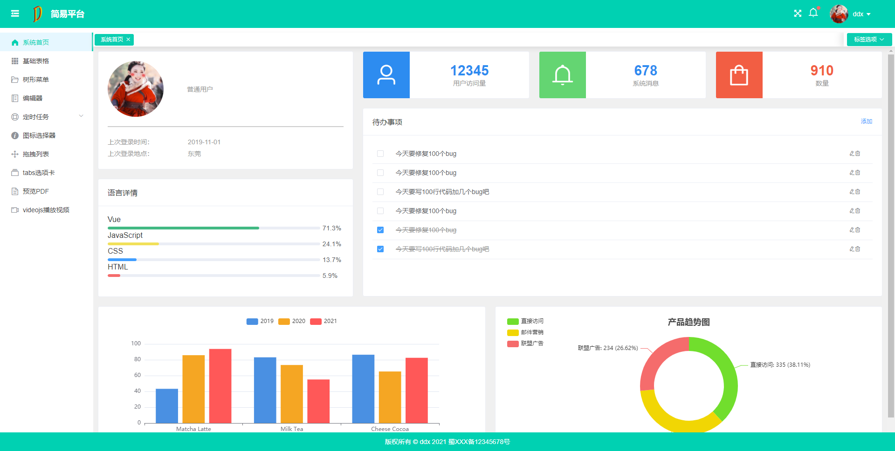
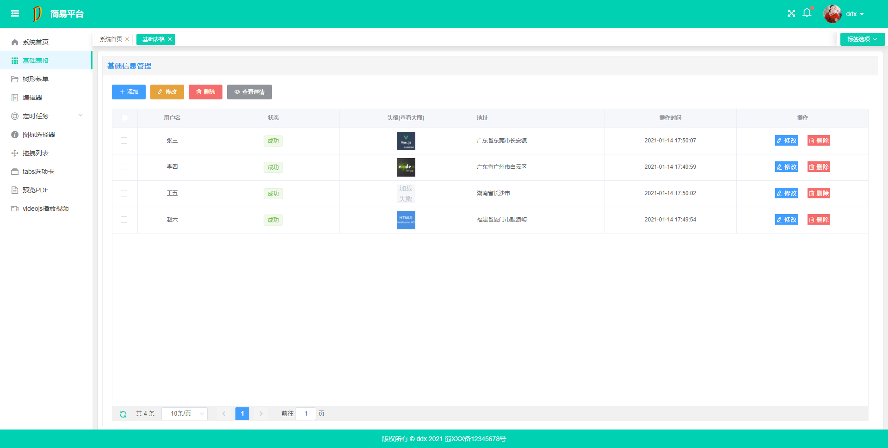
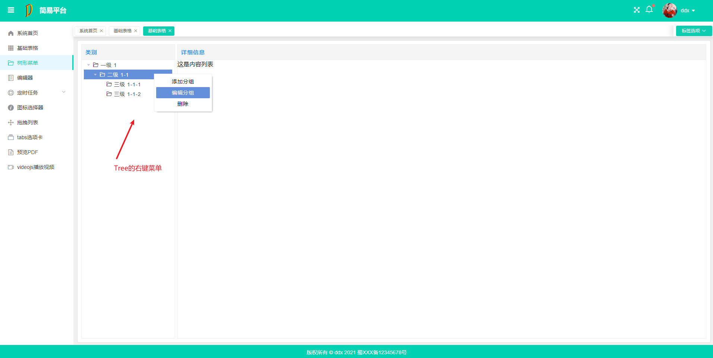
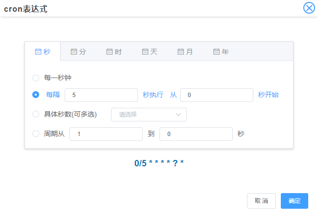
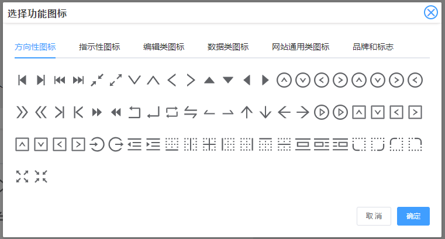
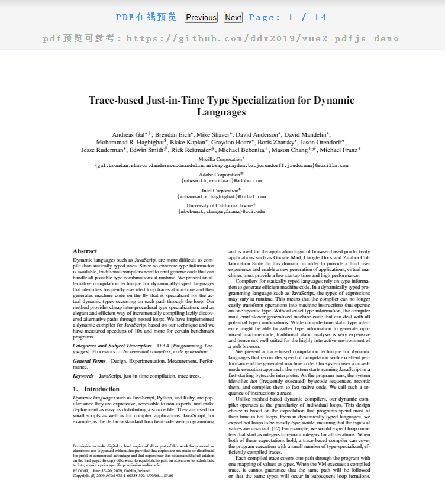
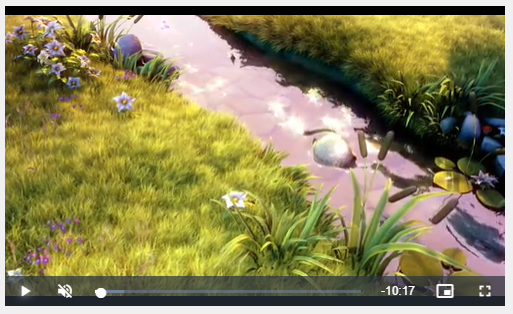

# vue2-element-simple-demo

1. vue2+ElementUI 的后台简易系统,
2. 该系统基于林鑫 的 vue-manage-system （github 地址：https://github.com/lin-xin/vue-manage-system）
3. 做了一些更改，如将 tagsList 的事件总线的方式改为了 vuex 管理。
4. 对 ElementUI 的弹框等样式进行了重写。
5. 新增了一些小插件的用法，以及平常封装的一些小东西。

## 项目预览（截图）：

### 1.首页



### 2.基础表格



### 3.树形菜单



### 4.定时任务与 cron 表达式



### 5.在 vue 中使用 ant-design-vue (https://antdv.com/components/icon-cn/) 的 icon 组件，做一个图标选择器



### 6.在 vue 中使用 PDF.js 预览 PDF 文档



### 6.在 vue 中使用 video.js 播放 m3cu8 格式的视频



## 安装步骤

```
git clone https://github.com/ddx2019/vue2-element-simple-demo.git  // 克隆项目

cd vue2-element-simple-demo  // 进入项目根目录

yarn install  // 安装项目依赖，等待安装完成；也可用 npm 或 cnpm

yarn serve   // 启动项目

yarn build  // 执行构建命令
```

## 相关描述

1. CSDN 主页：https://blog.csdn.net/ddx2019
2. 掘金主页：https://juejin.cn/user/254742429707175
3. vue-manage-system 项目的 github 地址： https://github.com/lin-xin/vue-manage-system

### 自定义配置

配置参考：https://cli.vuejs.org/config/
